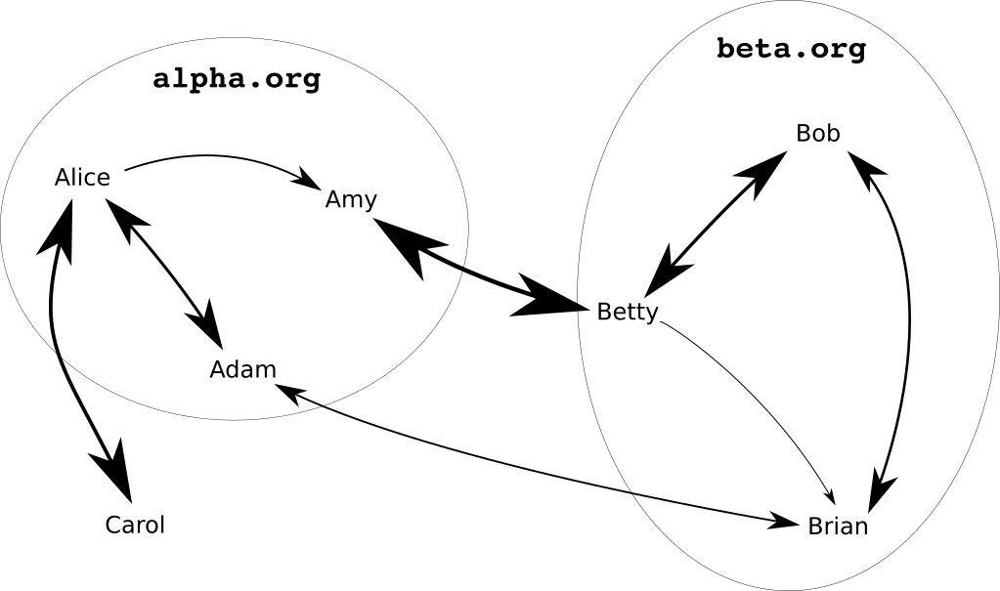

# A High-Level overview of OpenPGP CA

OpenPGP CA is two things:

1. It's a paradigm (a set of best practices) for how to use OpenPGP in
   organizations or groups.

2. And, it's tooling to more easily apply this paradigm in practice.

One of the most important aspects of secure communication is making sure
that your message goes to the right person and that messages you receive
actually came from the person they claim to. This is authentication - and
the core of what OpenPGP CA deals with.
The OpenPGP CA paradigm for how to handle authentication greatly simplifies
authentication for users and makes it commonplace.

For many use cases, it's indispensable to establish authentication before
using encryption. Using encryption on an unauthenticated communication
channel is risky - we can't tell if our communication is secure.

OpenPGP CA introduces tooling that an admin can use to record
organizational knowledge in a form that OpenPGP software already understands. For
instance, Alice Adams' email address is `alice@example.org` and this is a copy of
her OpenPGP public key.  This is the authentication aspect.  
The tooling also facilitates key discovery, by making it easy for the admin to
publish keys in places that OpenPGP software normally looks for them (e.g.
[WKD](https://tools.ietf.org/html/draft-koch-openpgp-webkey-service-09)s
and key servers).
And, it makes it easier to keep those directories up to date.
Finally, OpenPGP CA simplifies managing keys by storing revocation certificates,
and making it easy to publish one, if and when that is necessary.

OpenPGP CA works with existing OpenPGP software.  OpenPGP is an [encryption and digital signing standard](https://en.wikipedia.org/wiki/Pretty_Good_Privacy#OpenPGP), which is often used with email.  The other widely used email encryption standard, which OpenPGP CA does not deal with, is [S/MIME](https://en.wikipedia.org/wiki/S/MIME).  
There are [many implementations](https://www.openpgp.org/software/developer/) of OpenPGP.  The most well known implementation is [GnuPG](https://gnupg.org/), but there is also [OpenPGP.js](https://openpgpjs.org/)
and [Sequoia PGP](https://sequoia-pgp.org), which OpenPGP CA uses internally.

## How OpenPGP gets introduced to organizations

Anecdotal evidence suggests that OpenPGP is often introduced to an organization by a technically competent person who recognizes a need for secure communication.
That person then convinces everyone to adopt OpenPGP.
They organize a briefing (which is sometimes called a CryptoParty), and teach everyone how to
generate a key, how to do key discovery, how to certify keys, etc.
When done well, the members of the organization learn what they need
to do to communicate securely.

But, even in the best cases, most users often
only have a superficial understanding of what they need to do, and the technical leader needs to
provide them with intense support.  And, due to the high overhead, authentication is often
neglected based on the perception that
"usually we will find the correct key in some kind of ad-hoc manner, anyway."

## Authentication

The overarching goal of OpenPGP CA is that users can be certain
they are using the correct OpenPGP keys for their communication partners.
This is called
[authentication](https://en.wikipedia.org/wiki/Authentication):
ascertaining that a key is indeed the correct key for the other party.  (A closely
related goal is key discovery, which OpenPGP CA also simplifies.)

Imagine that we're sending an email to Alice. When authentication works, our
email client will show a green icon, or something similar when we have the
right key for Alice.

{+ screenshot(s) of thunderbird - with/without authentication}

More precisely, what is authenticated is the association between an identity
and a key. Authentication deals with identities and
asserts that there is reason to believe that a key in question is indeed controlled by a certain identity.

If we want to be sure that an identity associated with a key is correct,
we need to perform steps to authenticate that key. A traditional method to
authenticate a key with OpenPGP is to have the owner communicate the fingerprint of
that key.
We might get it in person - asking the owner
to confirm that the fingerprint we have is the correct one. Or, the person
might have given us a business card that includes their fingerprint.
These approaches are time consuming, and often not possible (what if you never
meet the person in real life?).  OpenPGP CA simplifies authentication by
non-exclusively delegating that task to a trusted party.

### The importance of authentication

When we obtain an OpenPGP key that claims to belong to Alice from an
untrusted source, we cannot be sure if the key is indeed controlled by
Alice, and not by some malicious party.

This is a problem, because a malicious party could perform various types
of attacks, including:

- send us a seemingly correctly signed email (which might lead to false
confidence in the origin of a piece of email - such attacks are called [phishing](https://en.wikipedia.org/wiki/Phishing) or [spear-phishing](https://en.wikipedia.org/wiki/Phishing#Spear_phishing)), or

- intercepting our attempts to securely communicate with Alice through an
encrypted channel
(["man-in-the-middle attack"](https://en.wikipedia.org/wiki/Man-in-the-middle_attack)).

## With OpenPGP CA the most common communication partners are automatically authenticated

People often mainly communicate with others in the same
organization - and with people in one of a few affiliated organizations. 

For example, imagine two organizations `alpha.org` and `beta.org`. Each
organization has a number of users, some of whom exchange lots of email,
others only infrequently. Some users might in addition have regular email
contacts outside of the two organizations.

With OpenPGP CA, when communication follows this type of pattern, users'
OpenPGP software will be able to authenticate their most common
communication partners without any extra effort from the user.
Members of the organization automatically have
authenticated paths to the people they communicate with most: people
within their organization, and their usual external collaborators.

## Intended Audience

OpenPGP CA helps organizations or groups model trust relations in OpenPGP.

We use the term "organization" to refer to any
group of people who might use OpenPGP CA together - whether they are an
informal group, a commercial organization, or any other form - such as:

- Journalistic organizations
- Human rights groups
- Informal groups of activists
- A company or a department at a company

OpenPGP CA's approach is based on the observation that in organizations,
users already trust their administrators with access to their data
(including email) and the integrity of their systems.  So, asking them to
also maintain a directory of users and keys does not require placing
additional trust in them.

## Users need to learn fewer skills

Implementing any new security practice requires educating users about its operational
aspects.  The difficulty is making sure users are not overwhelmed,
as that undermines the security goals.

Traditionally, users of OpenPGP have had to learn many technical details.
These details are necessary to achieve the security goals.  OpenPGP CA
doesn't remove these details, but shifts them to a new actor, the OpenPGP CA admin.
This greatly lessens the burden placed on normal users,
who are more interested in getting their job done than understanding the technical
minutiae.

Concretely, OpenPGP CA users only need to be taught a few high-level skills to
get significant value from OpenPGP:

- encrypt and sign email, as well as
- how to recognize encrypted and signed email.

OpenPGP CA alleviates non-technical users from having to learn many low-level
tasks, such as:

- doing key discovery,
- checking that a key belong to the intended party (authentication and certification), and
- creating their own key.

This allows users to focus on the indispensable high-level concerns
and reduces the risk of user errors.

This setup has several advantages for users. By delegating authentication
to an in-house CA, the cognitive burden placed on users is significantly
reduced: users don't have to compare fingerprints or even understand keys
or certifications to effectively use OpenPGP.
At the same time, because OpenPGP CA uses OpenPGP's existing mechanisms,
users with special needs can still use other solutions, e.g., directly
verifying someone's key in the customary manner.

## The OpenPGP CA admin role

**What is the CA admin role?**

OpenPGP has traditionally been aimed at individual users, each fending for
themselves. Our approach introduces the role of an "OpenPGP CA admin", a
per-organization role that serves as a centralized facilitator for
OpenPGP users in that organization.

The OpenPGP CA admin authenticates users within an organization,
so that users within that organization are mutually authenticated.
Users can use each others' OpenPGP keys with confidence - without
the need to spend effort on low-level details about key discovery and
authentication.

The key assumption for OpenPGP CA is that users have a common trusted
party who can perform this OpenPGP CA admin role for them.

In formal organizations, this might be the existing OPSEC team. In an
informal group it might be a person who volunteers for that job and is
viewed by the other team members as both technically competent and
trustworthy.

**Trade-offs of centralizing responsibility for authentication**

Users need to trust their OpenPGP CA admin to do OpenPGP authentication on
their behalf. This effectively centralizes authentication, which deviates
from OpenPGP's decentralized tradition. However, contrary to TLS where a third-party customarily does the authentication,
users in an organization already trust their administrator.

In many cases, the OpenPGP CA admin role will be filled by the users'
system administrator. In that role, the
administrator already control the users' systems - and can install
arbitrary software, for instance.

In other words, such an administrator is already in a position where they could undermine the
integrity of users' systems in practically limitless ways.

Therefore trusting this admin to also authenticate business relationships
does not change existing trust boundaries - and does not increase the
organization's risk.
  
In short, the centralization that the OpenPGP CA admin role brings is
not a significant change to users' threat models, and does not undermine
OpenPGP's decentralized nature.
 

**Risks when a CA admin makes mistakes**

The role of the CA admin centralizes tasks 
that would otherwise be the responsibility of individual users.
As described above, this brings a lot of benefits for users, however, it
also introduces new, centralized risks. 

One particular difficulty in deploying OpenPGP CA is that the CA admin's
key needs to be well protected.  If it is compromised, then an attacker
is able to mark arbitrary keys as authenticated.

Apart from that, when authenticating keys, the CA admin needs to be
diligent. The CA admin needs to have a good understanding of OpenPGP concepts
be able to perform their tasks correctly. If the CA admin makes mistakes,
users are at risk.  Depending on the consequences, not using OpenPGP CA
may be better than creating a false sense of security.

## Comparing the OpenPGP CA admin role with CAs for TLS server certificates

The concept of a certificate authority (CA) is well known in the context of
[TLS server certificates](https://en.wikipedia.org/wiki/Public_key_certificate#TLS/SSL_server_certificate),
which are used for authenticated and encrypted communication on the web.

TLS certificates claim an identity (the domain name of a website). This
identity is verified and cryptographically vouched for by a CA. CAs
for TLS server certificates act as a group of globally trusted
verifiers of identity (often, but not always, for-profit).
To organizations that use TLS certificates, these CAs are external actors.

While TLS server certificates of course bring massive benefits for
secure communication on the web, there are also problems:  
The interests of CAs in the TLS space are not aligned with the interests
of their users.
- For-profit CAs are driven by profit, not by the needs of users.
- Law enforcement might interact with these CAs in ways that are contrary
  (and opaque) to the users of the certificates and detrimental to their
  goals.  CAs agree to help, because they don't want to cause trouble
  with law enforcement.

These risks are real.  TLS CAs have been known to be [sloppy](https://en.wikipedia.org/wiki/NortonLifeLock#Google_and_Symantec_clash_on_website_security_checks) and [potentially malicious](https://en.wikipedia.org/wiki/China_Internet_Network_Information_Center#Fraudulent_certificates).
And, the authentication that the CAs perform is often extremely weak.

Our main observation about TLS in this context is that it 
centralizes trust in untrustworthy third parties.

## Interests of the OpenPGP CA admin and their users are aligned

In contrast, OpenPGP CA facilitates a decentralized, federated approach to
trust and authentication.
OpenPGP CA embraces OpenPGP's decentralized trust model and makes it easy to
leverage its inherent benefits.

Trust management with OpenPGP CA is somewhat centralized - but only
*within* the scope of individual organizations.
The interests of the in-house CA admin are strongly aligned with the
interests of the users and the organization overall.

Using OpenPGP CA does not require placing trust in an outside third party with
potentially conflicting interests. This is essential for activists,
journalists, and lawyers.

## Bridges between organizations

OpenPGP CA cannot only be used to create authenticated paths between users in a single organization, but also between organizations, in a decentralized, federated manner.

Affiliated organizations that use OpenPGP CA can easily set up a
so-called bridge between their respective CAs.
Creating a bridge creates authenticated paths between all users in the two
organizations - users in each organizations can authenticate
keys of users in the other without any additional effort.

This makes sense when the CA admins believe that the other organization's
CA admin does a good job authenticating their user's keys in OpenPGP CA.

As usual, we want to exploit existing trust boundaries.  When an organization
creates a bridge to another organization, the latter organization's CA admin
is only trusted to authenticate users in their own organization.  This
is done by scoping the trust: when the CA admin from organization
A authentictes the CA admin from organization B, they indicate that B should
only be trusted to authenticate users in the same organization.  This
is done using existing OpenPGP mechanisms.  Specifically, by matching on
the email's domain name.

## No key escrow

Centrally storing users' private key material has legitimate uses - however,
it also comes with massive risks.

OpenPGP CA does not do key escrow - that is, even when OpenPGP CA
generates keys for users, the private key material
is never stored in the OpenPGP CA database.

## Complements existing OpenPGP usage

Because OpenPGP CA works within the existing OpenPGP framework, i.e., it
doesn't require any modification of existing OpenPGP software,
users do not need any new software to take advantage of OpenPGP CA.
Concretely, they can continue to use existing email clients and encryption
plugins. Further, OpenPGP CA can co-exist with other authentication
approaches like traditional key certification workflows.

OpenPGP CA can be rolled out gradually within an organization.

While OpenPGP CA prescribes some aspects of how OpenPGP keys and
certifications should be handled, our approach offers [some degrees of
freedom](tradeoffs.md), so that security specialists in organizations can tailor
their use to their specific needs.
That said, our framework/paradigm makes OpenPGP key management less ad-hoc and
more systematic.

## OpenPGP CA as tooling for the admin

OpenPGP CA vastly improves the capabilities of the administrator by
giving them tooling to model *existing* trust relationships in their
organization.

Traditionally, tooling in the OpenPGP ecosystem was mainly aimed
at users. Dedicated administrators of OpenPGP setups have built ad-hoc
tools for tasks they perform, but these were point solutions, and often
incomplete.

The benefits of OpenPGP CA are - at least in theory - not particular to
OpenPGP CA: a dedicated administrator could perform all of the relevant tasks
manually.
However, in practice, these tasks are so hard for administrators to
perform correctly with existing tooling that no one uses this type of
setup.

## Is OpenPGP CA suitable for my use case?

OpenPGP CA is not for every everyone.  Here are some considerations:

- OpenPGP CA is for groups.  An individual will not profit from installing OpenPGP CA, because they have no one to delegate authentication to.
- There has to be a trusted, competent party who can perform
  the OpenPGP CA admin role.  
  The CA admin needs to have the relevant knowledge as well as skillset,
  and users must trust them to do authentication on their behalf.
- OpenPGP CA exposes the structure of the organization.  For most companies,
  this is not a problem, because they already have employee directories.  For
  some activist groups, this may be a problem.
