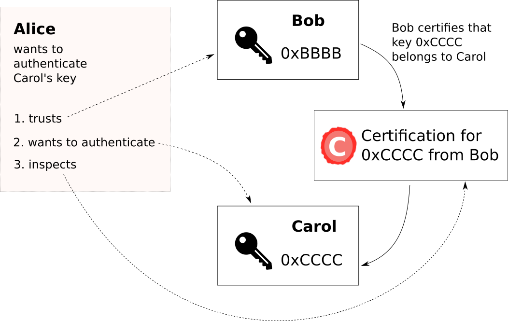
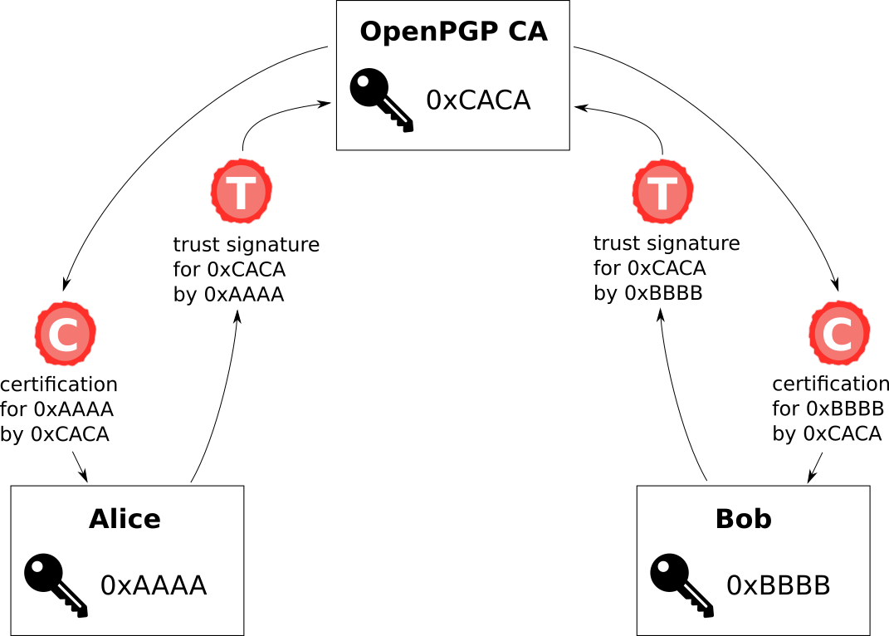
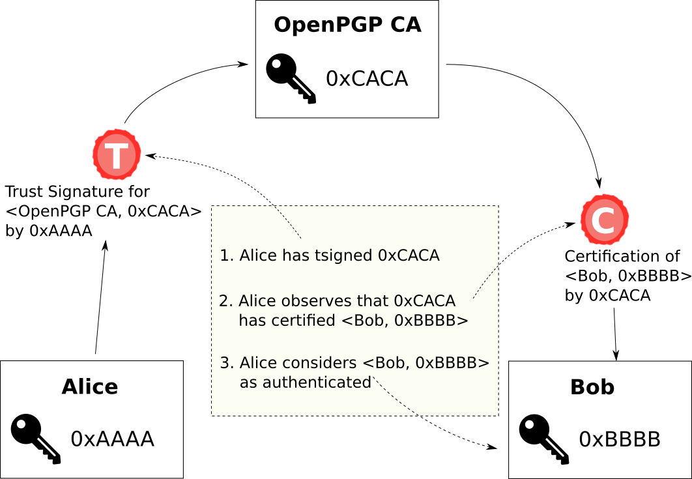
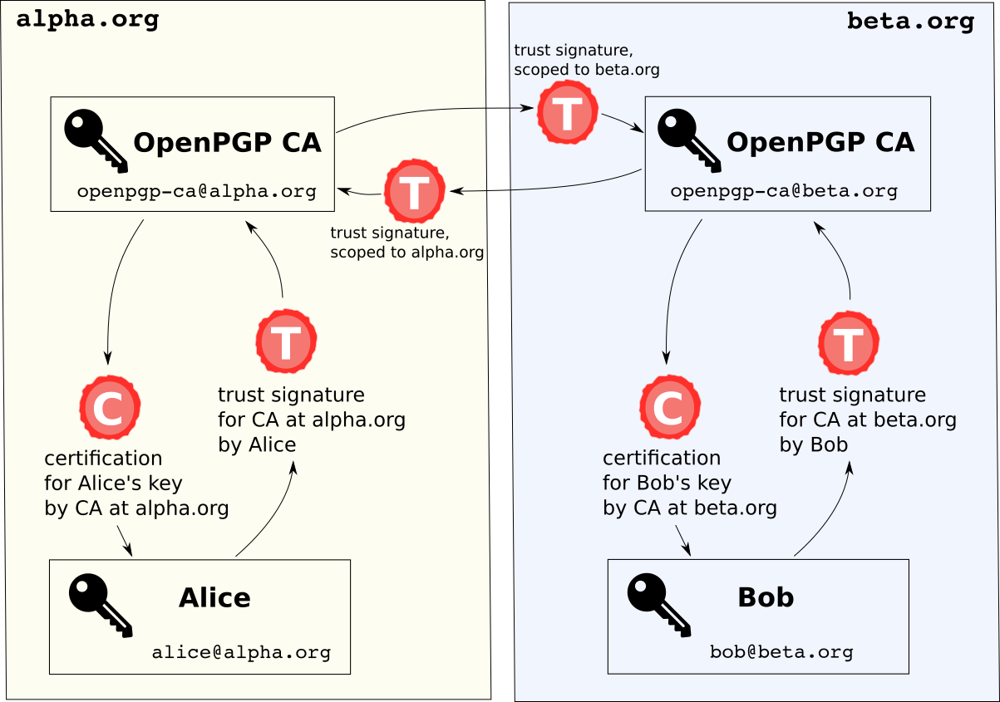

This chapter describes how OpenPGP CA works at a technical level.
First, we describe the OpenPGP data structures that it uses.  Then
we describe some relevant points of OpenPGP CA's implementation.

# What is OpenPGP CA

- OpenPGP CA is a CLI tool for use by the admin
  - implemented as a library (reusable for other frontends)
- written in Rust
- OpenPGP CA uses the [Sequoia](https://sequoia-pgp.org/) OpenPGP implementation
- All state is persisted in a single file (using an SQLite database)

# How authentication works in the OpenPGP web of trust

The OpenPGP standard provides a powerful mechanism to authenticate keys: the
["web of trust"](https://en.wikipedia.org/wiki/Web_of_trust).

The web of trust is built on certifications. A certification is a
machine-readable vouch, which asserts that an
identity (a person, a machine, or an organization) controls some key. These certifications
can be exchanged between OpenPGP implementations and users, and are typically
included when distributing OpenPGP keys.

## Regular certifications

A certification is a record that indicates what key an entity allegedly
controls.  When Bob certified that Carol's key is `0xCCCC`, he can create
a certification that records that fact.  The certification is first
useful to him: all of his software now understands that he has verified
Carol's key.  If he publishes the certification, e.g., on a key server,
it can also be useful to others.

Say that Alice wants to communicate with Carol, but she hasn't authenticated
Carol's key.  If she has access to Bob's certification she has evidence that
`0xCCCC` is the right key for Carol.  Of course, Carol should only trust Bob's
certification as much as she trusts Bob to correctly certify Alice's
key.

## Trust signatures

OpenPGP certifications are extremely powerful.  For instance, Bob could
indicate that he not only believes that Carol controls key `0xCCCC`, but
that he considers Carol to be a trusted introducer, i.e., a certificate
authority (CA).  In OpenPGP speak, this is done using a type of
certification called a
["trust signature"](https://tools.ietf.org/html/rfc4880#section-5.2.3.13)
(this term is sometimes abbreviated as *tsig*).

Trust signatures provide nuance.  It is possible to [scope
the trust using regular expressions](https://tools.ietf.org/html/rfc4880#section-5.2.3.14) over the User ID.  For instance,
Carol may trust Dave from the NSA to certify users within his own
organization, but not other people.

With GnuPG, it's possible to get similar semantics to trust signatures by
setting the ownertrust property for keys. When using GnuPG, if a
user were to set this ownertrust property on the OpenPGP CA key to the
value 'Fully', their setup would work as expected.  

However, OpenPGP CA strongly prefers the use of trust signatures to designate
the OpenPGP CA key as trusted. Trust signatures are specified in the
OpenPGP standard, and as a standardized OpenPGP concept, they work the same
with all OpenPGP implementations.

# How the OpenPGP CA paradigm works for authentication

Our approach to authentication is built using the existing and well-established
OpenPGP "web of trust" mechanisms.
Because these mechanisms are part of the OpenPGP
specification, all OpenPGP implementations understand them. Thus OpenPGP CA
works out of the box with existing OpenPGP implementations, such as GnuPG.

## Authentication within an organization

With OpenPGP CA, the CA key certifies the keys of all of the users in the
organization using normal OpenPGP certifications.  To take advantage of this,
users in the organization need to set the CA's key to be a trusted introducer.
In OpenPGP terms, users generate a trust signature for the CA's key.

In short, each user normally certifies the CA's key, and the CA
certifies each user's key.

Consider, for instance, Alice whose email address is `alice@example.org`:

- The CA key certifies the `alice@example.org` user id on Alice's key.  This
  certification means that the CA has verified that the key is indeed
  controlled by Alice.  
  As a consequence of this certification, anyone who uses
  `openpgp-ca@example.org` as a trusted introducer has an authenticated
  path to Alice's key.
- Alice's key certifies `openpgp-ca@example.org` using a trust signature.
  This trust signature means that Alice
  trusts certifications that the CA key makes on other keys; Alice trusts
  the CA to authenticate third parties on her behalf.

The following figure shows the keys and certifications in an
OpenPGP CA-using organization with two users, Alice and Bob.
 

These mutual certifications between each user and the CA mean that all
members of the organization have a verified path to each other.  And this
remains the case even as users leave and join the organization: users don't
need to take any special action to authenticate new users, only the
OpenPGP CA admin does.

For example, if Alice wants to authenticate Bob, her OpenPGP implementation
can use two certifications to do the authentication: the trust signature
she made on the CA's key, and the certification that the CA made on Bob's
key,  which the next figure illustrates:.

## Authentication between organizations: Bridges

Organizations often work closely with a few other
organizations.  It greatly simplifies the work of such
organizations if their users don't have to manually validate each other's
keys to securely communicate.  OpenPGP CA supports this use case by
by faciliating the creation of so-called "bridges" between organizations.

In technical terms, OpenPGP CA bridges organizations using *scoped* trust signatures.
For instance, if users at the two organizations `alpha.org` and `beta.org`
communicate with each other on a regular basis, then the OpenPGP CA
administrators can exchange fingerprints, and create a trust
signature over each other's domain.    These trust signatures are usually scoped to the domain of the
respective remote organization. The reason for this is that the CA admin of
`alpha.org` probably only wants the `beta.org` CA admin to act as a trusted
introducer for users at `beta.org` - and not for keys outside that
namespace.  
Allowing the remote CA admin to act as a trusted introducer for arbitrary
user ids would give the remote CA admin much too much power.

Using a bridge, members of each organization can authenticate members of
the bridged organization as illustrated in the following figure:

## Gateways into organizations

Because users use a trust signature to certify the OpenPGP CA's key,
anyone who considers someone at an OpenPGP CA-using organization to be a
trusted introducer can also automatically authenticate everyone else in the
organization.

## Emergent Properties

Most individual users of OpenPGP won't use trusted introducers.  But that
doesn't mean that their tools can't make use of such certifications.
Consider the following scenario.
Alice and Bob are from organization ABC, which uses OpenPGP
CA.  And Zed, an individual who is not part of an organization that uses
OpenPGP CA, regularly communicates with Alice.  Now, let's say that Zed
wants to send Bob an email.  Zed might find many keys that claim to be
Bob's.  Some might be keys that Bob has lost control of and hasn't revoked.
Others may have been published by an attacker.  What key should he use for
Bob?

Because we use standard OpenPGP artifacts - in particular trust signatures -
we can publish them. Then, using the normal web of trust mechanisms, Zed's
tools can detect a reasonable key for
Bob based on two observations.  First, the tool can observe that there
is a verified path from Alice to Bob's current key in the web of
trust.  Second, since Zed is able to successfully communicate with
Alice, there is a good chance that he has the correct key for her.
Thus, we have a likely reasonable candidate key for Bob even if it is
not strongly authenticated.

This approach is just a heuristic.  But, it is a good
heuristic when strong authentication is not required, and avoids the frustrating and debilitating
scenario in which Zed uses the wrong key and Bob can't decrypt his
message.

# Key creation, certification

The OpenPGP CA admin makes sure that a structure of certifications exists
between keys in the organization.

There are two different ways in which user keys may be created in an organization that uses OpenPGP CA:

1. Key creation for users can be (centrally) [performed by the OpenPGP CA
admin](keys-create.md).  In this case, because OpenPGP CA
creates the user's key, it can also generate all of the required
certifications on its own.  OpenPGP CA only keeps the private key material
in RAM and never saves it to disk. Still, this method is more risky
than the alternative.

2. The alternative is that users [create their own keys](keys-import.md)
(decentrally).
In this workflow, the user sends their public key to  the OpenPGP
CA admin, who, after authenticating it, adds it to the database.  
To get all of the benefits of OpenPGP CA, the user also needs to
certify the OpenPGP CA key.  This is more complicated, but only needs to be
done during the initial setup.  With help from the
CA admin or a help desk team, this is doable.  In the next version of OpenPGP CA, we will add tooling to make this workflow as easy as the other workflow.

# Revocation Certificates

OpenPGP CA optionally generates and stores several revocation
certificates for users. The reason to create
multiple revocations is so that at a later time, the most appropriate
revocation reason can be used. e.g., key lost, key compromised, etc.

In theory, we could simply have users set the CA key as a designated revoker,
but there isn't much support for designated revokers in the OpenPGP ecosystem.

# What happens on a user's computer

## Centralized workflow

In OpenPGP CA, the CA admin can provision a user with a
key. In addition to generating the key, OpenPGP CA creates certifications
between the new user key and the CA's key.  The admin sends the key to the user.  This can be done by saving it on a USB drive,
or sending it by email (but encrypting it with a strong password).  And, the
 public
key is optionally published in the organization's WKD, and uploaded to
key servers.

The user then imports their new private key and sets it to
be "ultimately" trusted (i.e., they tell their OpenPGP implementation that this is
their own key), and they import the CA's public key.

Following this, the user has an OpenPGP setup where their OpenPGP software
can automatically find the keys
for their coworkers (via WKD) and strongly authenticate those keys.  The users
don't need to compare fingerprints, they don't need to go to a key signing party, 
in fact, they doesn't even need to understand what a certification is.

## Decentralized workflow

In some organizations or for some advanced users, it might be preferrable
to generate user keys directly on the user's own machine, instead of
having new keys generated centrally by the CA admin. 

This workflow is slightly more complex to perform:

- The user needs to obtain the CA's public key,
- generate their own new key,
- generate a trust signature for the CA's key.
- This certification and the user's public key need to be transferred to
 the CA admin.
- The CA admin then needs to import this new user key into OpenPGP CA, which
  then automatically certifies the specified uids of the user's new key.

# What happens on the OpenPGP CA admin side

OpenPGP CA as a tool for the CA admin contains a database for a number of
artifacts:
 
- It is a central repository of all
public OpenPGP keys of the users in the organization, as well as for
certifications between the users and the CA admin.

- Further, OpenPGP CA's database also optionally contains [revocation
certificates](#revocation-certificates) for user keys.

- Finally, the CA's private OpenPGP key is in the database - it is used
to generate the certifications, and as such needs to be kept safe.

Currently, OpenPGP CA can export OpenPGP Keys and create a WKD.  The admin
needs to publish these manually.  For OpenPGP CA 2.0, we plan to add
support to more easily publish these artifacts in key servers, in the
organization's WKD, and as GPG Sync-style Keylists.