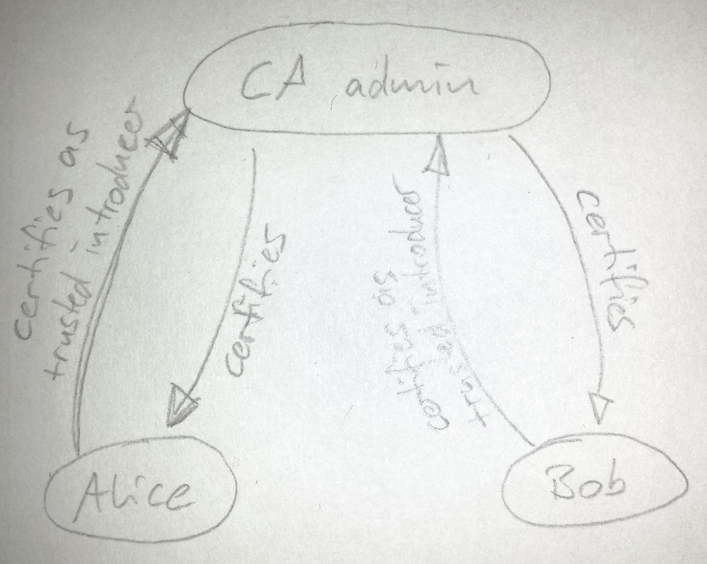

Technical details

# How authentication works in the OpenPGP web of trust

OpenPGP provides a powerful mechanism to authenticate keys: the
["web of trust"](https://en.wikipedia.org/wiki/Web_of_trust).

The web of trust is built on certifications. A certification is a
machine-readable vouch, which asserts that an
identity controls a particular key {simplify/unpack?}. These certifications
can be exchanged between OpenPGP implementations and users, and are typically
included when distributing OpenPGP keys.

## Regular certifications

If Alice wants to determine whether Carol controls key 0xCCCC, then she
can use these certifications as evidence.  For instance, if Bob certified that
Carol controls key 0xCCCC, then his certification is evidence that Carol
controls key 0xCCCC.  Of course, Alice should only trust Bob's
certification as much as she trusts Bob to correctly certify Carol's
key.

## Trust signatures

OpenPGP certifications are extremely powerful.  For instance, Bob could
indicate that he not only believes that Carol controls key 0xCCCC, but
that he considers Carol to be a trusted introducer, i.e., a certificate
authority (CA).  In OpenPGP speak, this is done using a type of
certification called a
["trust signature"](https://tools.ietf.org/html/rfc4880#section-5.2.3.13).

Trust signatures provide nuance.  For instance, it is possible to [scope
the trust using regular expressions](https://tools.ietf.org/html/rfc4880#section-5.2.3.14) over the User ID.  For instance,
Carol may trust Dave from the NSA to certify users within his own
organization, but not other people.

These mechanisms are standard OpenPGP mechanisms, which all OpenPGP
implementations support.

{neal} They are standard, but they are not supported by all implementations  
{neal} one could argue that those implementations are implementing openpgp

# How the OpenPGP CA paradigm works for authentication

Our approach to authentication is built using the existing and well
established OpenPGP "web of trust" mechanisms.
Because these mechanisms are standardized as part of the OpenPGP
specification, all OpenPGP implementations understand them. Thus deploying
OpenPGP CA doesn't require modifying existing OpenPGP implementations (such
as GnuPG) or translating formats.

The OpenPGP CA paradigm models trust as shown in the following sections.

## Authentication of individual user keys by the CA

(do we need this? - remove?!)

In OpenPGP CA, the CA key certifies the keys of all of the users in the
organization using normal OpenPGP certifications.

{ This is equivalent to "Keylist's" authenticated keylists, but is
natively understood by OpenPGP implementations. }

## Authentication within one organization

OpenPGP CA prescribes that between each user's key and the CA key, two
certifications should exist:

- The CA key certifies the *alice@example.org* user id on Alice's key.  This
  certification means that the CA has verified that the key is indeed
  controlled by Alice.  
  As a consequence of this certification, anyone who uses
  *openpgp-ca@example.org* as a trusted introducer has an authenticated
  path to Alice's key.
- Alice's key certifies *openpgp-ca@example.org* using a trust signature.
  This trust signature (sometimes referred to as a "tsig") means that Alice
  will trust certifications that the CA key makes on other keys: Alice trusts
  the CA to authenticate third parties on her behalf.
  (This is equivalent to marking the CA key as fully trusted in GnuPG.)  
  {This trust signature means that anyone who
  considers "alice@example.org" to be a trusted introducer (which Alice
  does---it's her key) will also trust "openpgp-ca@example.org" to be a
  trusted introducer.}

These mutual certifications between each user and the CA mean that all
members of the organization have a verified path to each other, now and in
the future.

If Alice wants to authenticate Bob, two certifications are checked by her
OpenPGP implementation: the trust signature she made on the CA's key, and
the certification that the CA made on Bob's key.

## Authentication between organizations: Bridges

Organizations often work closely with a small number of other
organizations.  It greatly simplifies the work of such
organizations when their users don't have to manually validate each other to
securely communicate.

OpenPGP CA supports this use case by allowing to create "bridges" between
organizations.
Creating a bridge makes sense when the administrators of both organizations
feel that it's useful to mutually authenticate the users of their
respective organizations, in bulk.

In technical terms, OpenPGP CA bridges organizations using trust signatures.
For instance, if users at the two organizations *foo.org* and *bar.org*
communicate with each other on a regular basis, then the OpenPGP CA
administrators can exchange fingerprints, and create a trust
signature over each other's domain.  Now, members of each organization can
authenticate members of the other organization.

**Scoped trust for bridges**

Trust signatures for bridges are usually scoped to the domain of the
respective remote organization. The reason for this is that the CA admin of
*foo.org* probably only wants the *bar.org* CA admin to act as a trusted
introducer for users at *bar.org* - and not for keys outside that namespace.  
Allowing the remote CA admin to act as a trusted introducer for arbitrary
user ids would give the remote CA admin (as a third party) too much power.

^ add domainnames to diagram

{If a CA is known to be compromised, OpenPGP CA will provide a wizard
to revoke such certifications.}

## Gateways into organizations

An added bonus of using a trust signature is that anyone who considers
someone at an OpenPGP CA-using organization to be a trusted introducer
can also automatically authenticate everyone else in the organization.

{ There is no equivalent to this in "Keylist". }

## Emergent Properties

Most users don't use trusted introducers.  But, that doesn't mean that
tools can't exploit the web of trust.  Consider the following
scenario.  Alice and Bob are from organization ABC, which uses OpenPGP
CA.  Zed regularly communicates with Alice, but can't authenticate her key
using the web of trust.  Now, Zed wants to send Bob an email.  Zed
might find many keys for Bob.  Some might be keys that Bob has lost
control of and hasn't revoked.  Others may have been published by an
attacker.  What key should he use for Bob?

Using the web of trust, Zed's tools can detect a reasonable key for
Bob based on two observations.  First, the tool can observe that there
is a verified path from Alice to Bob's current key in the web of
trust.  Second, since Zed is able to successfully communicate with
Alice, there is a good chance that he has the correct key for her.
Thus, we have a likely reasonable candidate key for Bob.

This approach is just a heuristic.  But, it is probably a good
heuristic in many cases, and avoids the frustrating and debilitating
scenario in which Zed uses the wrong key and Bob can't decrypt his
message.

# Key creation, certification

The OpenPGP CA admin facilitates user's handling of OpenPGP keys, and in
particular makes sure the relevant certifications exist between keys in the
organization:

Key creation for users can be [performed by the OpenPGP CA
admin](flow-central.md) - which means that the admin has temporary
access to this user's private key material.

Alternatively, keys can be [generated on the user's machine](flow-decentral.md).
In this workflow, the user's public key is imported into the OpenPGP
CA database after creation.  
Certifications between the user's key and CA admin key must then be
set up from both sides, the resulting artifacts published and retrieved.
(The workflow to use keys that users generate for themselves will be
streamlined with GPG Sync support in OpenPGP CA 2.0 -
until then it involves some manual work on the part of users as well as
the CA admin)

# Revocation Certificates

OpenPGP CA optionally generates and stores several revocation
certificates for users. The reason that it creates
multiple revocations is so that at a later time, the most appropriate
revocation reason can be used. e.g., key lost, key compromised, etc.

{Ideally, we'd only rely on designated revokers, but there isn't much
support for this feature in the OpenPGP ecosystem.}

# What needs to happen on a user's computer

## Centralized workflow

In OpenPGP CA, the CA admin typically provisions users with a
key. In addition to generating a key, OpenPGP CA creates certifications
between the new user key and the CA's key.
  
Then user then receives and imports their new private key and sets it to
"ultimately" trusted (i.e. tell their OpenPGP implementation that this is
their own key) and the CA admin's public key into their OpenPGP instance.

{set up client to receive keys for others in the organization, if there's a
 local scheme for that in place?}

Following this, the user has an OpenPGP setup where they can simply
authenticate most of their communication partners without taking any
further steps.
 
{no comparing fingerprints, no key signing parties, no
understanding what a certification is}

## Decentralized workflow

In some organizations or for some advanced users, it might be preferrable
to generate user keys directly on the user's own machine, instead of
having new keys generated centrally by the CA admin. 

This workflow is slightly more complex to perform:

- The user needs to obtain the CA admin's public key,
- generate their own new key,
- generate a "trust signature" certification for the CA admin's key.
- This certification and the user's public key need to be transferred to
 the CA admin.
- The CA admin then imports this bew user key into OpenPGP CA, which
- automatically certifies the specified uids of the user's new key.

Currently, handling new keys in this decentralized manner is slightly more
complicated than centralized generation as described above.
 
However, simplifying this workflow is the main goal of OpenPGP CA 2.0

# What happens on the OpenPGP CA admin side

OpenPGP CA as a tool for the CA admin contains a database for a number of
artifacts:
 
- It is a central repository of all
public OpenPGP keys of the users in the organization, as well as for
certifications between the users and the CA admin.

- Further, OpenPGP CA's database also optionally contains [revocation
certificates](#revocation-certificates) for user keys.

- Finally, the CA admin's private OpenPGP key is in the database - it is used
to generate all certifications, and as such needs to be kept safe.

OpenPGP CA 2.0 will support exporting user as well as the CA admin's public
keys to key servers, to WKD servers, or as a Keylist.
